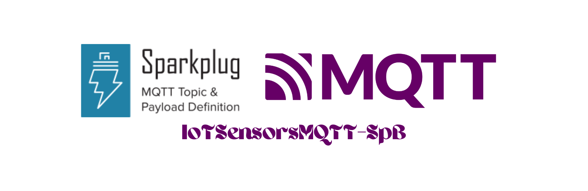
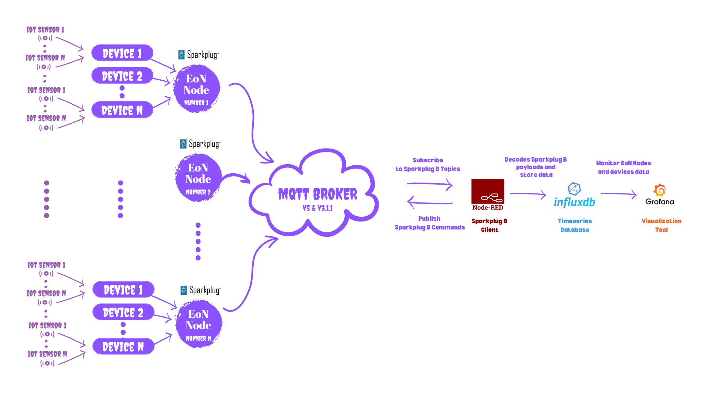
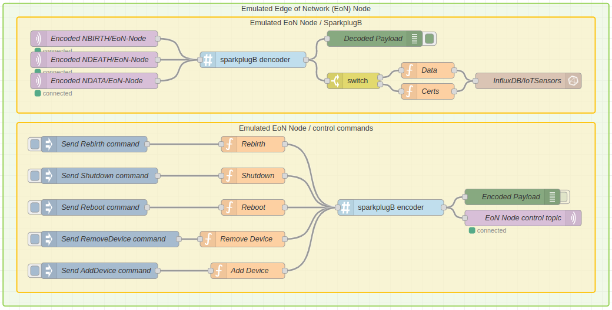
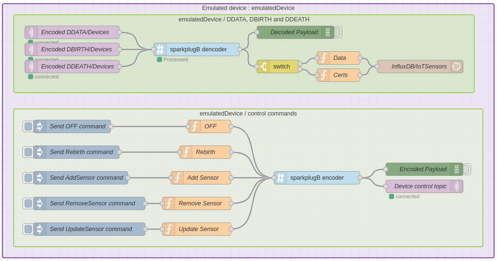
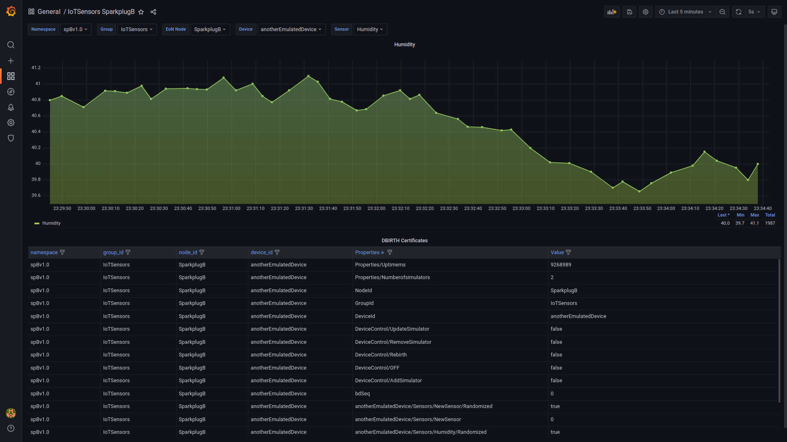
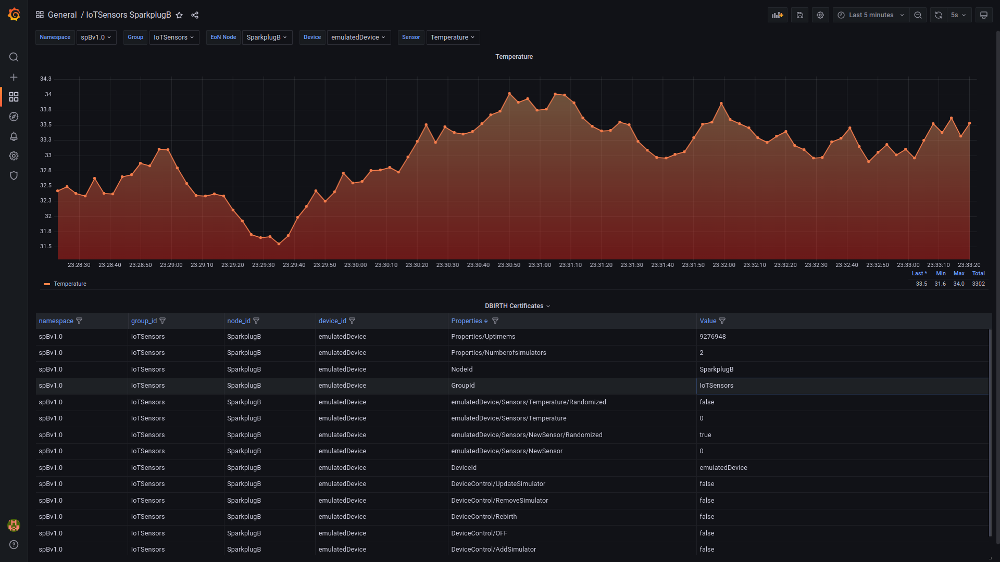
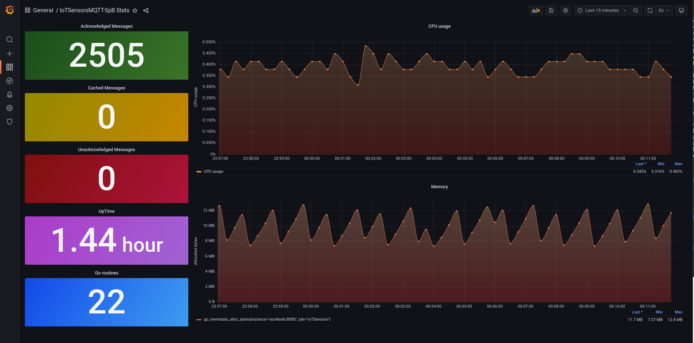
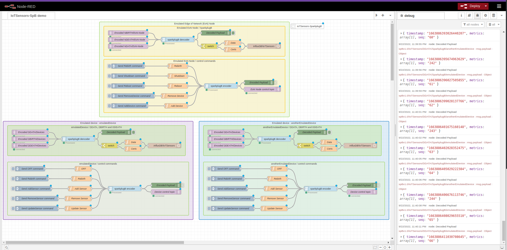

<div align="center">

  
  <h1>MQTT Sparkplug B implementation in GO</h1>
  
  <p>
    Emulated EoN Nodes and devices with MQTT Sparkplug B
  </p>
  
<!-- Badges -->
<p>
  <a href="https://github.com/amine-amaach/simulators/graphs/contributors">
    
  </a>
  <a href="https://github.com/amine-amaach/simulators/network/members">
    
  </a>
  <a href="https://github.com/amine-amaach/simulators/stargazers">
    
  </a>
  <a href="https://github.com/amine-amaach/simulators/issues/">
    
  </a>
  <a href="https://github.com/amine-amaach/simulators/blob/main/LICENCE">
    
  </a>
  <a href="https://www.linkedin.com/in/amine-amaach/">
    
  </a>
</p>
   
<h4>
    <a href="#">Demo</a>
  <span> · </span>
    <a href="https://github.com/amine-amaach/simulators/issues/">Report Bug</a>
  <span> · </span>
    <a href="https://github.com/amine-amaach/simulators/issues/">Request Feature</a>
  </h4>
</div>

<br>

<!-- Table of Contents -->
# 📒 Table of Contents

- [✨ About the Project](#✨-about-the-project)
- [⚙️ Configuration](#⚙️-configuration)
- [📎 Demo](#📎-demo)
- [💻 Development](#💻-development)
- [👋 Contact](#👋-contact)
- [🤝 Contributing](#🤝-contributing)
- [💎 Acknowledgements](#💎-acknowledgements)

<!-- About the Project -->
## ✨ About the Project


* **IoTSensorsMQTT-SpB** is an implementation of the MQTT Sparkplub B specification in GO with a full simulation of edge of network (EoN) nodes and devices built upon it. **IoTSensorsMQTT-SpB** can simulate an EoN node with multiple devices attached to it and each device can connect multiple IoT sensor simulators as a meaningful data source. With the Docker image, you can deploy a simulation of multiple EoN (edge of network) nodes using a standard and simple configuration file.

<br>


> Basic Configuration :
```json
{
    "mqtt_config": {
        "url": "tcp://localhost:1883",
        "qos": 1,
        "client_id": "",
        "user": "",
        "password": "",
        "keep_alive": 5,
        "connect_timeout": "30s",
        "connect_retry": 3,
        "clean_start": false,
        "session_expiry_interval" : 60 
    },

    "eon_node": {
        "namespace": "spBv1.0",
        "group_id": "IoTSensors",
        "node_id": "SparkplugB",
        "devices": [
            {
                "device_id": "emulatedDevice",
                "store_and_forward": true,
                "time_to_live": 10,
                "simulators": [
                    {
                        "sensor_id": "Temperature",
                        "mean": 30.6,
                        "standard_deviation": 3.1,
                        "delay_min": 3,
                        "delay_max": 6,
                        "randomize": true
                    }
                ]
            },
            {
                "device_id": "anotherEmulatedDevice",
                "store_and_forward": true,
                "time_to_live": 15,
                "simulators": [
                    {
                        "sensor_id": "Humidity",
                        "mean": 40.7,
                        "standard_deviation": 2.3,
                        "delay_min": 4,
                        "delay_max": 10,
                        "randomize": false
                    }
                ]
            }
        ]
    },

    "logger": {
        "level": "INFO",
        "format": "TEXT",
        "disable_timestamp": true
    },
    
    "enable_prometheus": true
}
``` 
  > Don't hesitate to try out some crazy configs. 

### Fields description :

  * `mqtt_config` : Contains the connection details to an MQTT broker.    
    - `url` : The MQTT broker URL to connect to. 
    - `qos` : The level of delivery guarantee to enforce (Quality Of Service). 
    - `client_id` : An identifier for the client connection. Leave it blank for autogenerate.
    - `username` : A username to assume for the connection.
    - `password` : A password to provide for the connection.
    - `keepalive` : Max seconds of inactivity before a keepalive message is sent. 
    - `connect_timeout` : The maximum amount of time to wait in order to establish a connection before the attempt is abandoned. (Default : "30s")
    - `connect_retry` : How long in seconds to wait between connection attempts.
    - `clean_start` : States if the session should be kept by the broker when the client disconnects.
    - `session_expiry_interval` : How long in minutes the broker stores the session information of this MQTT client.

      > The equivalent for cleanSession=true in the CONNECT packet of MQTTv3 in MQTTv5 is sessionExpiry=0 (or absent) and cleanStart=true.
      > The equivalent for cleanSession=false in the CONNECT packet of MQTTv3 in MQTTv5 is using a sessionExpire value that is greater than zero and cleanStart=false

  * `eon_node` : Defines the EoN node with the desired devices as well as the IoT sensor simulators.
    - `namespace` : Defines the topic namespace (Default : "spBv1.0")
    - `group_id` : The element of the Sparkplug™ Topic Namespace provides for a logical grouping of MQTT EoN nodes into the MQTT broker and back out to the consuming MQTT Clients.
    - `node_id` : The element of the Sparkplug™ Topic Namespace uniquely identifies the MQTT EoN node within the infrastructure.
    - `devices` an array of the desired EoN node devices.
      - `device_id` : The element of the Sparkplug™ Topic Namespace identifies a device attached to the MQTT EoN node.
      - `store_and_forward` : Specifies whether to enable the `Store and Forward` feature or not. If set to `true`, this microservice guarantees a strong data delivery, whether the connection with the broker is down or up. Otherwise, it is up to the MQTT protocol to deliver the data based on the specified `qos`.
      - `time_to_live` : The maximum amount of time to keep the unacknowledged messages before dropping them. 
      - `simulators` : An array of the desired simulators attached to the device. 
      
        - `sensor_id` :  The simulated IoT Sensor identifier. 
        - `mean` :  The mean of the simulated IoT Sensor data. 
        - `standard_deviation` :  The standard deviation of the simulated IoT Sensor data. 
        - `delay_min` :  Min secondes between the data point of the simulator. 
        - `delay_max` :  Max secondes between the data point of the simulator. 
        - `randomize` :  Specifies whether the delay between data points should be random or not based on the `delay_min` and `delay_max`. if set to `false`, `delay_min` will be the fixed period between data points.

           > The simulator generates data based on the mean and standard deviation of a real sensor data.

  * `logger` : Defines the logger parameters.  
    - `level` : Specifies the logger's level : `ERROR`, `TRACE`, `DEBUG`, `FATAL`, `WARN` or `INFO`.    
    - `format` : Logging format : `TEXT` or `JSON`.
    - `disable_timestamp` : Specifies whether to enable timestamp in the logging data or not.

  * `enable_prometheus` : Indicates whether to enable a `Prometheus` endpoint to monitor this microservice stats (Memory, CPU usage, Uptime, Number of Acknowledged and Unacknowledged messages as well as the number of cached messages) or not. (:8080/metrics)

<br>

> The `Store and Forward` feature uses a built-in cache to store device data when the published data point is not acknowledged by the broker or when the connection is lost, and keeps it in the store for the specified `time_to_live` (TTL) period. Thus, this microservice will attempt to republish the data point whenever the connection with the broker is re-established while the `TTL` has not expired.  

> Following the Sparkplug B specification, you can send commands to the EoN node at runtime to perform pre-defined commands in both the NBIRTH and DBIRTH certificates. To learn more, check out the demo below on how to send Sparkplug commands using NodeRed. 

> this microservice is very lightweight and you can enable the `Prometheus` endpoint to monitor its performance. Check out the demo below on how to enable it.

> A docker image is available to design and run any desired simulation, and you can also build custom images upon it. 

> Important : if you're planing to use a public broker, please bear in mind that these public brokers limit the size of the published packets (1024 bytes as a max) to receive, thus, according to the MQTT specification the broker will send a _Disconnect_ packet to the client. this microservice uses a DBIRTH certificate that exceeds 1024 bytes in the packet size, therefore it can't send it if you're using a public broker. In the demo below, we're using a local broker by EMQX that supports both MQTT v5 and v3.1.

> Important : this microservice uses the `autopaho` MQTT client implementation in GO by the Eclipse Foundation that only supports MQTT v5, so please make sure that the broker you're using supports MQTT v5. 

<br>

## 📎 Demo

* Demo video : [MQTT Sparkplug B data simulator](https://youtu.be/dfqTsJFMq_w)


<br>

  

<br>


* The following [demo](https://github.com/amine-amaach/simulators/tree/main/exapmles/ioTSensorsMQTT-SpB) shows you how to run a full simulation of the EoN node with multiple attached devices and simulated IoT sensors.
  - We're using `NodeRed` as a Sparkplug client to decode the Sparkplug B payloads and store the data in `InfluxDB` for further analytics with `Grafana`.
  - Using `NodeRed`, we can send several commands to the EoN node and its devices, such as :
      - For an EoN node, we can send the following pre-defined commands :
          - `Rebirth` command to get the EoN node birth certificate.
          - `Reboot` command to perform a reboot simulation of the EoN node.
          - `Shutdown` command to gracefully shutdown the EoN node and the attached devices.
          - `AddDevice` command to add a device to the EoN node that is defined in a Sparkplug template.
          - `RemoveDevice` command to detach a device from the EoN node specified in a Sparkplug template.
          
          
      
      - For a device, we can send the following pre-defined commands :
          - `Rebirth` command to get the device birth certificate.
          - `OFF` command to turn off the device.
          - `AddSimulator` command to add a simulated IoT sensor to the device that is defined in a Sparkplug template.
          - `RemoveSimulator` command to remove a simulated IoT sensor from the device that is specified in a Sparkplug template.
          - `UpdateSimulator` command to update the parameters of a simulated IoT sensor attached to the device that are defined in a Sparkplug template.
          
            

  - In this demo we enable the metrics endpoint to monitor the microservice performance using `Prometheus` and `Grafana`.
  - For the MQTT broker, we're using the open source `EMQX` broker.
  - For deployment, we're using a docker compose file to run all these services together with a single command.

* To run this demo, please make sure you have `Docker` installed in your machine, then clone/download this repository to your preferred location and change directory to `simulators/examples/ioTSensorsMQTT-SpB/`, run the following command : `docker compose up -d` and have fun.

    > Just in case `NodeRed` complains about missing nodes, these are the nodes used in this demo : `node-red-contrib-influxdb` and `node-red-contrib-protobuf`.

* Some screenshots of the demo :

      
    
      
    
    

      

* Please let me know if you're using this project and I'm looking forward to your feedback.

<!-- Development -->
## 💻 Development

<br>

> Make sure you have GO installed (1.18+)

1. Clone this repository :

```bash
  git clone git@github.com:amine-amaach/simulators.git && cd ioTSensorsMQTT-SpB
```

2. Run 🏃

```sh
  go run cmd/sparkplug/main.go
```
_And Happy Coding_

<br>

## 👋 Contact

<br>

Amine Amaach - [LinkedIn](https://www.linkedin.com/in/amine-amaach/) - [Email](amine.amaach@um6p.ma)

Website : [amineamaach.me](https://amineamaach.me/)

Project Link : [https://github.com/amine-amaach/simulators.git](https://github.com/amine-amaach/simulators.git)

<br>

## 🤝 Contributing

<br>

<a href="https://github.com/amine-amaach/simulators/graphs/contributors">
  
</a>


> Every bit helps! If you come across any bugs, please send a bug report, or if you feel inclined to fix it yourself, submit a pull request.

<br>

## 💎 Acknowledgements

<br>

 - [Eclipse/Sparkplug](https://github.com/eclipse/sparkplug)
 - [Paho](https://github.com/eclipse/paho.mqtt.golang)
 - [Viper](https://github.com/spf13/viper)
 - [Logrus](https://github.com/sirupsen/logrus)
 - [Benthos](https://github.com/benthosdev/benthos)
