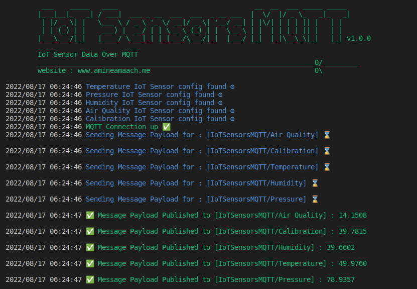
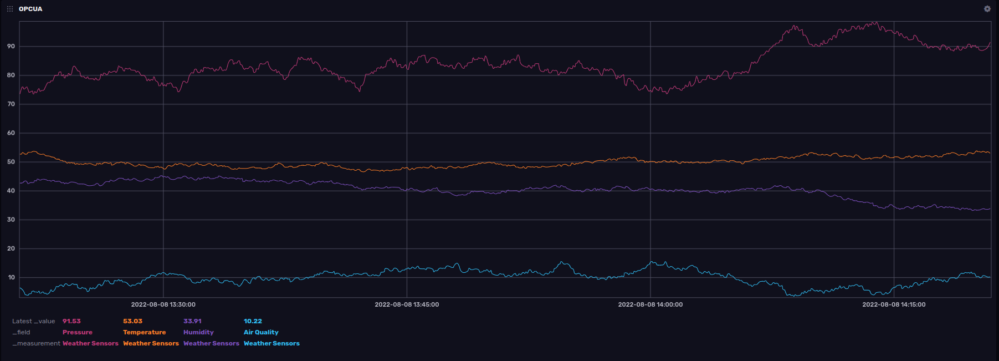

<div align="center">

  
  <h1>IoT Sensors Data Simulator - MQTT</h1>
  
  <p>
    IoT Sensors Data over MQTT
  </p>
  
<!-- Badges -->
<p>
  <a href="https://github.com/amine-amaach/simulators/graphs/contributors">
    
  </a>
  <a href="https://github.com/amine-amaach/simulators/network/members">
    
  </a>
  <a href="https://github.com/amine-amaach/simulators/stargazers">
    
  </a>
  <a href="https://github.com/amine-amaach/simulators/issues/">
    
  </a>
  <a href="https://github.com/amine-amaach/simulators/blob/main/LICENCE">
    
  </a>
  <a href="https://www.linkedin.com/in/amine-amaach/">
    
  </a>
</p>
   
<h4>
    <a href="#">Demo</a>
  <span> · </span>
    <a href="https://github.com/amine-amaach/simulators/issues/">Report Bug</a>
  <span> · </span>
    <a href="https://github.com/amine-amaach/simulators/issues/">Request Feature</a>
  </h4>
</div>

<br>

<!-- Table of Contents -->
# 📒 Table of Contents

- [About the Project](#✨-about-the-project)
- [Development](#💻-Development)
- [Environment Variables](#⚙️-Configuration)
- [Contact](#🤝-contact)
- [Contributing](#👋-contributing)
- [Acknowledgements](#💎-acknowledgements)

<!-- About the Project -->
## ✨ About the Project


* **IoTSensorsMQTT** is an IoT sensor data simulator that allows you to realistically simulate multiple IoT sensors with great flexibility and minimal configuration.

<br>

<div align="center"> 
  
</div>

<br>

> Sample of the data generated by the simulator :
<div align="center"> 
  
</div>

<br>

> Configuration file for the previous result :
```json
{
    "MQTT_BROKER": {
        "SERVER_URL":"mqtt://broker.hivemq.com:1883",
        "SERVER_USER": "",
        "SERVER_PWD": "",
        "SERVER_RETAIN": "true",
        "SERVER_QOS": 1,
        "CLIENT_ID": "IoTSensorsMQTT-Simulator",
        "KEEP_ALIVE": 300, 
        "RETRY_DELAY": 10,
        "ROOT_TOPIC": "IoTSensorsMQTT",
        "SET_DELAY_BETWEEN_MESSAGES" : 5,
        "RANDOMIZE_DELAY_BETWEEN_MESSAGES" : "true"
    },   

    "SIMULATORS": [
        {
            "Name" : "Temperature",
            "Mean" : 50.0,
            "StandardDeviation" : 3.0
        },
        {
            "Name" : "Pressure",
            "Mean" : 80.0,
            "StandardDeviation" : 9.0
        },
        {
            "Name" : "Humidity",
            "Mean" : 40.0,
            "StandardDeviation" : 3.0
        },
        {
            "Name" : "Air Quality",
            "Mean" : 15.0,
            "StandardDeviation" : 5.0
        }
    ]
}
``` 
> The simulator generates data based on the mean and standard deviation of the actual sensor data.

<br>

<!-- Development -->
## 💻 Development

<br>

> Make sure you have GO installed (1.18+)

1. Clone this repository :

```bash
  git clone git@github.com:amine-amaach/simulators.git && cd ioTSensorsMQTT
```

2. Run 🏃

```sh
  go run cmd/main.go
```
_And Happy Coding_

<br>

## ⚙️ Configuration

<br>

The application is configured using the following variables:

> SERVER_URL

* The address of the MQTT server.

> SERVER_USER

* The name of the MQTT user with subscribe and publish permissions.

> SERVER_PWD

* The password for the MQTT user with subscribe and publish permissions.

> CLIENT_ID

* The client id to use when connecting to the broker.

> SET_DELAY_BETWEEN_MESSAGES

* Allows you to set the delay between data points in seconds.

> RANDOMIZE_DELAY_BETWEEN_MESSAGES

* Allows you to randomize the duration between data points, when set to `false` SET_DELAY_BETWEEN_MESSAGES is used as fixed duration.

> SIMULATORS

* Allows you to define simulators with their parameters.

  > Name : The sensor's name.
  
  > Mean : The data mean of the actual sensor.
  
  > StandardDeviation : The data Standard Deviation of the actual sensor.

<br>

## 🤝 Contact

<br>


Amine Amaach - [LinkedIn](https://www.linkedin.com/in/amine-amaach/) - [Email](amine.amaach@um6p.ma)
Website : amineamaach.me
Project Link : [https://github.com/amine-amaach/simulators.git](https://github.com/amine-amaach/simulators.git)

<br>

## 👋 Contributing

<br>

<a href="https://github.com/amine-amaach/simulators/graphs/contributors">
  
</a>


> Every bit helps! If you come across any bugs, please send a bug report, or if you feel inclined to fix it yourself, submit a pull request.

<br>

## 💎 Acknowledgements

<br>

 - [Paho](https://github.com/eclipse/paho.mqtt.golang)
 - [Viper](https://github.com/spf13/viper)
 - [bitperfect](https://bitperfect.at/en/blog/simulation-von-sensordaten)
