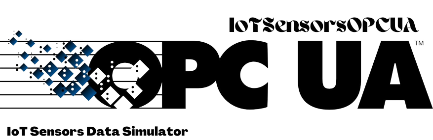
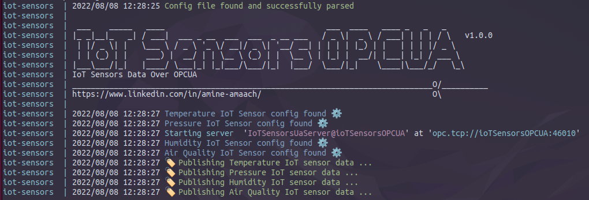
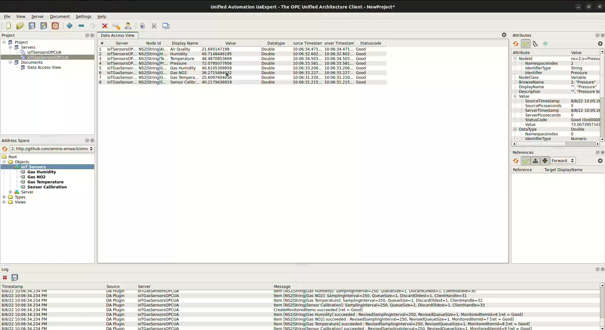
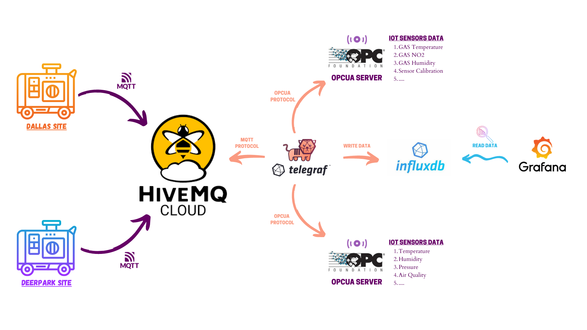

<div align="center">

  
  <h1>IoT Sensors Data Simulator - OPCUA</h1>
  
  <p>
    IoT Sensors Data over OPCUA
  </p>
  
<!-- Badges -->
<p>
  <a href="https://github.com/amine-amaach/simulators/graphs/contributors">
    
  </a>
  <a href="https://github.com/amine-amaach/simulators/network/members">
    
  </a>
  <a href="https://github.com/amine-amaach/simulators/stargazers">
    
  </a>
  <a href="https://github.com/amine-amaach/simulators/issues/">
    
  </a>
  <a href="https://github.com/amine-amaach/simulators/blob/main/LICENCE">
    
  </a>
  <a href="https://www.linkedin.com/in/amine-amaach/">
    
  </a>
</p>
   
<h4>
    <a href="#">Demo</a>
  <span> · </span>
    <a href="https://github.com/amine-amaach/simulators/issues/">Report Bug</a>
  <span> · </span>
    <a href="https://github.com/amine-amaach/simulators/issues/">Request Feature</a>
  </h4>
</div>

<br>

<!-- Table of Contents -->
# 📒 Table of Contents

- [About the Project](#✨-about-the-project)
  * [Screenshots](#📷-screenshots)
- [Using the simulator](#📎-Using-the-simulator)
- [Development](#💻-Development)
- [Environment Variables](#⚙️-Configuration)
- [Contact](#🤝-contact)
- [Contributing](#👋-contributing)
- [Acknowledgements](#💎-acknowledgements)

<!-- About the Project -->
## ✨ About the Project


* **IoTSensorsOPCUA** is an IoT sensor data simulator that allows you to realistically simulate multiple IoT sensors with great flexibility and minimal configuration.

<br>


> Sample of the data generated by the simulator :
<div align="center"> 
  
</div>

<br>

> Configuration file for the previous result :
```json
{
    "SET_DELAY_BETWEEN_MESSAGES" : 5,
    "RANDOMIZE_DELAY_BETWEEN_MESSAGES" : "true",
    "SIMULATORS": [
        {
            "Name" : "Temperature",
            "Mean" : 50.0,
            "StandardDeviation" : 3.0
        },
        {
            "Name" : "Pressure",
            "Mean" : 80.0,
            "StandardDeviation" : 9.0
        },
        {
            "Name" : "Humidity",
            "Mean" : 40.0,
            "StandardDeviation" : 3.0
        },
        {
            "Name" : "Air Quality",
            "Mean" : 15.0,
            "StandardDeviation" : 5.0
        }
    ]
}
``` 
> The simulator generates data based on the mean and standard deviation of the actual sensor data.

<br>

<!-- Screenshots -->
## 📷 Screenshots

<br>

> ***IoTSensorsOPCUA*** microservice:
<div align="center"> 
  
</div>

<br />

> ***UaExpert OPCUA Client*** connected to ***IoTSensorsOPCUA*** server:
<div align="center"> 
  
</div>

<br>

## 📎 Using the simulator

<br>

> Check out a scenario of using the simulator :

* Docker is the recommended way to use the simulator. 

  > A Docker image of the simulator is available : `docker pull amineamaach/simulators-pgmqtt`.

<div align="center"> 
  
</div>

<br>

> To run this example (Using Docker):

1. Clone this repository :

```bash
  git clone git@github.com:amine-amaach/simulators.git && cd examples/ioTSensorsOPCUA/
```

2. Run 🏃

```sh
  docker compose up
```

<!-- Development -->
## 💻 Development

<br>

> Make sure you have GO installed (1.18+)

1. Clone this repository :

```bash
  git clone git@github.com:amine-amaach/simulators.git && cd ioTSensorsOPCUA
```

2. Run 🏃

```sh
  go run cmd/main.go
```
_And Happy Coding_

<br>

## ⚙️ Configuration

<br>

The application is configured using the following variables:

> SET_DELAY_BETWEEN_MESSAGES

* Allows you to set the delay between data points in seconds.

> RANDOMIZE_DELAY_BETWEEN_MESSAGES

* Allows you to randomize the duration between data points, when set to `false` SET_DELAY_BETWEEN_MESSAGES is used as fixed duration.

> SIMULATORS
* Allows you to define simulators with their parameters.

  > Name : The sensor's name.
  
  > Mean : The data mean of the actual sensor.
  
  > StandardDeviation : The data Standard Deviation of the actual sensor.

> USERIDs
* Allows you to add users to the OPCUA server for authenticated connections.

<br>

> ***Config Sample***
```sh
{
    "SET_DELAY_BETWEEN_MESSAGES" : 5,
    "RANDOMIZE_DELAY_BETWEEN_MESSAGES" : "true",
    "SIMULATORS": [
        {
            "Name" : "Temperature",
            "Mean" : 50.0,
            "StandardDeviation" : 3.0
        },
        {
            "Name" : "Pressure",
            "Mean" : 80.0,
            "StandardDeviation" : 9.0
        }
    ],
    "USERIDs": [
        {
            "Username" : "root",
            "Password" : "secret"
        }
    ]
}
```

<br>

## 🤝 Contact

<br>


Amine Amaach - [LinkedIn](https://www.linkedin.com/in/amine-amaach/) - [Email](amine.amaach@um6p.ma)

Project Link: [https://github.com/amine-amaach/simulators.git](https://github.com/amine-amaach/simulators.git)

<br>

## 👋 Contributing

<br>

<a href="https://github.com/amine-amaach/simulators/graphs/contributors">
  
</a>


> Contributions are always welcome!
For major changes, please open an issue first to discuss what you would like to change.

<br>

## 💎 Acknowledgements

<br>

 - [awcullen/opcua](https://github.com/awcullen/opcua)
 - [Viper](https://github.com/spf13/viper)
 - [bitperfect](https://bitperfect.at/en/blog/simulation-von-sensordaten)
