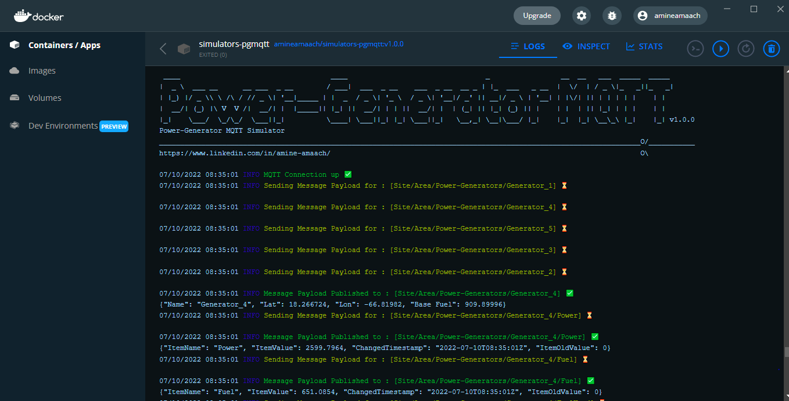
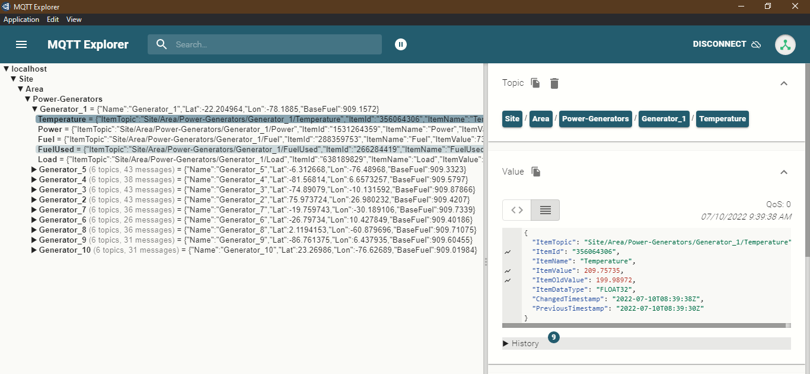
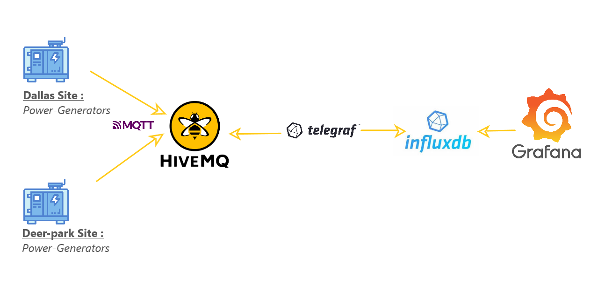

<div align="center">

  
  <h1>Power-Generator MQTT Simulator</h1>
  
  <p>
    Power-Generator Simulator over MQTT
  </p>
  
<!-- Badges -->
<p>
  <a href="https://github.com/amine-amaach/simulators/graphs/contributors">
    
  </a>
  <a href="https://github.com/amine-amaach/simulators/network/members">
    
  </a>
  <a href="https://github.com/amine-amaach/simulators/stargazers">
    
  </a>
  <a href="https://github.com/amine-amaach/simulators/issues/">
    
  </a>
  <a href="https://github.com/amine-amaach/simulators/blob/main/LICENCE">
    
  </a>
  <a href="https://www.linkedin.com/in/amine-amaach/">
    
  </a>
</p>
   
<h4>
    <a href="https://youtu.be/1XXsL2vwCGg">Demo</a>
  <span> · </span>
    <a href="https://github.com/amine-amaach/simulators/issues/">Report Bug</a>
  <span> · </span>
    <a href="https://github.com/amine-amaach/simulators/issues/">Request Feature</a>
  </h4>
</div>

<br>

<!-- Table of Contents -->
# 📒 Table of Contents

- [About the Project](#✨-about-the-project)
  * [Screenshots](#📷-screenshots)
- [Using the simulator](#📎-Using-the-simulator)
- [Development](#💻-Development)
- [Configuration](#⚙️-Configuration)
- [Contact](#🤝-contact)
- [Contributing](#👋-contributing)
- [Acknowledgements](#💎-acknowledgements)

<br>

<!-- About the Project -->
## ✨ About the Project

* Power generators are basically small power-plants. They allow their owners to generate electricity on-site, as a substitute or complement to electricity from the electric grid.
* **pgmqtt** is a simulator generates power generators data and publish it over MQTT.

* Each **power generator** will write to its own **MQTT** topic the following tags:
  - Load
  - Power
  - Temperature
  - Fuel Level
  - Base Fuel
  - Used Fuel
  
<br>

* The message payload of a simulated generator :
```json
{
  "Name": "Generator_1",
  "Lat": -65.37906,
  "Lon": -62.64473,
  "Base Fuel": 909.3602
}
```
* The message payload of a generator's tag :
```json
{
  "ItemTopic": "Site/Area/Power-Generators/Generator_8/Load",
  "ItemId": "147377909",
  "ItemName": "Load",
  "ItemValue": 69,
  "ItemOldValue": 71,
  "ItemDataType": "INT",
  "ChangedTimestamp": "2022-07-10T06:42:59+01:00",
  "PreviousTimestamp": "2022-07-10T06:42:54+01:00"
}
```

<br>

## 📷 Screenshots

<br>

> Power-Generator MQTT microservice :
<div align="center"> 
  
</div>

> MQTT Client subscribing to topics published by the microservice
<div align="center"> 
  
</div>

<br>

## 📎 Using the simulator

<br>

> Check out a scenario of using the simulator :

* Docker is the recommended way to use the simulator. 

  > A Docker image of the simulator is available : `docker pull amineamaach/simulators-pgmqtt`.

<div align="center"> 
  
</div>

[Watch it on YouTube](https://youtu.be/nm6ARNTKCII)

1. Clone this repository :

```bash
  git clone git@github.com:amine-amaach/simulators.git && cd examples/pgmqtt/
```

2. Run 🏃

```sh
  docker compose up
```

* You can configure the **pgmqtt** simulators through the config files in `examples/pgmqtt/configs/` or by using the environment variables in `examples/pgmqtt/docker-compose.yml`.

  > Note : Environment variables in `docker-compose.yml` will override the corresponding values in `config.json` if they exist.

  > Default topic for all the generators : `Site/Area/Power-Generators/#`

<br>

<!-- Development -->
## 💻 Development

<br>

> Make sure you have GO installed (1.18+)

1. Clone this repository :

```bash
  git clone git@github.com:amine-amaach/simulators.git && cd pgmqtt
```

2. Run 🏃

```sh
  go run cmd/pgmqtt/main.go
```
_And Happy Coding_

<br>

## 🛣️ Roadmap

<br>

- [x] Randomize the delay between messages separately for each generator.
- [x] Simulate multiple generators in a single `microservice`. 
- [ ] Support TLS connections.

<br>

## ⚙️ Configuration

<br>

The application is configured using the following environmental variables:

> SITE

* The ISA-95 Model site name. SITE used as the parent topic in the MQTT structure. If this is unset, _Site_ will be used.

> AREA

* The ISA-95 Model area name. AREA used as the second topic in the MQTT structure. If this is unset, _Area_ will be used.

> MQTT_SERVER_URL

* The address of the MQTT server.

> MQTT_SERVER_USER

* The name of the MQTT user with subscribe and publish permissions.

> MQTT_SERVER_PWD

* The password for the MQTT user with subscribe and publish permissions.

> MQTT_CLIENT_ID

* The client id to use when connecting to the broker.

> DELAY_BETWEEN_MESSAGES_MIN

* The minimum delay between messages in seconds. 

> DELAY_BETWEEN_MESSAGES_MAX

* The maximum delay between messages in seconds. 

> RANDOM_DELAY_BETWEEN_MESSAGES

* If set to `true` the delay between messages will be randomly generated based on `DELAY_BETWEEN_MESSAGES_MIN` and `DELAY_BETWEEN_MESSAGES_MIN` env variables, else `DELAY_BETWEEN_MESSAGES_MIN` will be set as fixed delay.

> GENERATORS_NUMBER

* The number of generators to simulate.

> GENERATORS_NUMBER_LIMIT

* The maximum number of generators to simulate, if `GENERATORS_NUMBER` > `GENERATORS_NUMBER_LIMIT` the number of generators will be set to `GENERATORS_NUMBER_LIMIT`

<br>

## 🤝 Contact

<br>

Amine Amaach - [LinkedIn](https://www.linkedin.com/in/amine-amaach/) - [Email](amine.amaach@um6p.ma)

Project Link: [https://github.com/amine-amaach/simulators.git](https://github.com/amine-amaach/simulators.git)

<br>

## 👋 Contributing

<br>

<a href="https://github.com/amine-amaach/simulators/graphs/contributors">
  
</a>

  > Every bit helps! If you come across any bugs, please send a bug report, or if you feel inclined to fix it yourself, submit a pull request.

<br>

## 💎 Acknowledgements & Inspiration

<br>

 - [Paho](https://github.com/eclipse/paho.mqtt.golang)
 - [Zap](https://github.com/uber-go/zap)
 - [Viper](https://github.com/spf13/viper)
 - [Libre Technologies](https://github.com/Spruik/libre-common)
 - [InfluxDB-Roadshow-Training](https://github.com/InfluxCommunity/InfluxDB-Roadshow-Training)