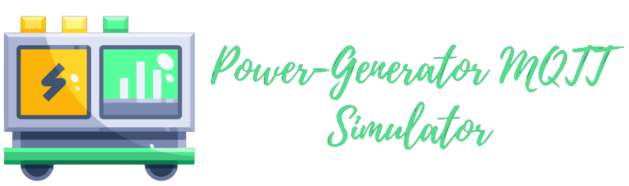

<div align="center">

  
  <h1>MQTT Power-Generator</h1>
  
  <p>
    An MQTT Power-Generator Simulator
  </p>
  
<!-- Badges -->
<p>
  <a href="https://github.com/amine-amaach/power-generator/graphs/contributors">
    
  </a>
  <a href="https://github.com/amine-amaach/power-generator/network/members">
    
  </a>
  <a href="https://github.com/amine-amaach/power-generator/stargazers">
    
  </a>
  <a href="https://github.com/amine-amaach/power-generator/issues/">
    
  </a>
</p>
   
<h4>
    <a href="https://github.com/amine-amaach/power-generator/">View Demo</a>
  <span> · </span>
    <a href="https://github.com/amine-amaach/power-generator">Documentation</a>
  <span> · </span>
    <a href="https://github.com/amine-amaach/power-generator/issues/">Report Bug</a>
  <span> · </span>
    <a href="https://github.com/amine-amaach/power-generator/issues/">Request Feature</a>
  </h4>
</div>

<br />

<!-- Table of Contents -->
# 📒 Table of Contents

- [About the Project](#star2-about-the-project)
  * [Screenshots](#camera-screenshots)
  <!-- * [Environment Variables](#key-environment-variables) -->
- [Run Locally](#running-run-locally)
- [Usage](#eyes-usage)
- [Roadmap](#compass-roadmap)
- [Contributing](#wave-contributing)
- [Contact](#handshake-contact)
- [Acknowledgements](#gem-acknowledgements)

  

<!-- About the Project -->
## ✨ About the Project


<!-- Screenshots -->
### 📷 Screenshots

* Power generators are basically small power-plants. They allow their owners to generate electricity on-site, as a substitute or complement to electricity from the electric grid.
* This simulator simulates these power generators data and publish it to an MQTT broker.

<div align="center"> 
  
</div>

<!-- Features -->
### 🎯 Features

- Power generators data simulation.
- Simulate multiple power generators.
- Publish data to MQTT brokers.
- ...


<!-- Env Variables
### :key: Environment Variables

To run this project, you will need to add the following environment variables to your .env file

`API_KEY`

`ANOTHER_API_KEY` -->


<!-- Installation
### :gear: Installation

Install my-project with npm

```bash
``` -->
   
<!-- Running Tests
### :test_tube: Running Tests

To run tests, run the following command

```bash
  make test
``` -->

<!-- Run Locally -->
### 🏃 Run Locally

Clone the project

```bash
  git clone git@github.com:amine-amaach/power-generator.git
```

Go to the project directory

```bash
  cd power-generator
```

<!-- Install dependencies

```bash
  go mod tidy
``` -->

Start the simulator

```bash
  make run
```


<!-- Usage
## :eyes: Usage

Use this space to tell a little more about your project and how it can be used. Show additional screenshots, code samples, demos or link to other resources.


```go
import Component from 'my-project'

function App() {
  return <Component />
}
``` -->


<!-- Roadmap -->
## 🛣️ Roadmap

- [x] Concurrent Simulator.
- [ ] Set up TLS connection.


<!-- Contributing -->
## 👋 Contributing

<a href="https://github.com/amine-amaach/power-generator/graphs/contributors">
  
</a>


Contributions are always welcome!

<!-- See `contributing.md` for ways to get started. -->

<!-- License -->
## ⚠️ License

Distributed under the no License. See LICENSE.txt for more information.

<!-- Contact -->
## 🤝 Contact

Amine Amaach - [LinkedIn](https://www.linkedin.com/in/amine-amaach/) - [Email](amine.amaach@um6p.ma)

Project Link: [https://github.com/amine-amaach/power-generator.git](https://github.com/amine-amaach/power-generator.git)


<!-- Acknowledgments -->
## 💎 Acknowledgements

<!-- Use this section to mention useful resources and libraries that you have used in your projects. -->

 - [Libre Technologies](https://github.com/Spruik/libre-common)
 - [InfluxDB-Roadshow-Training](https://github.com/InfluxCommunity/InfluxDB-Roadshow-Training)
 - [Zap](https://github.com/uber-go/zap)
 - [Viper](https://github.com/spf13/viper)